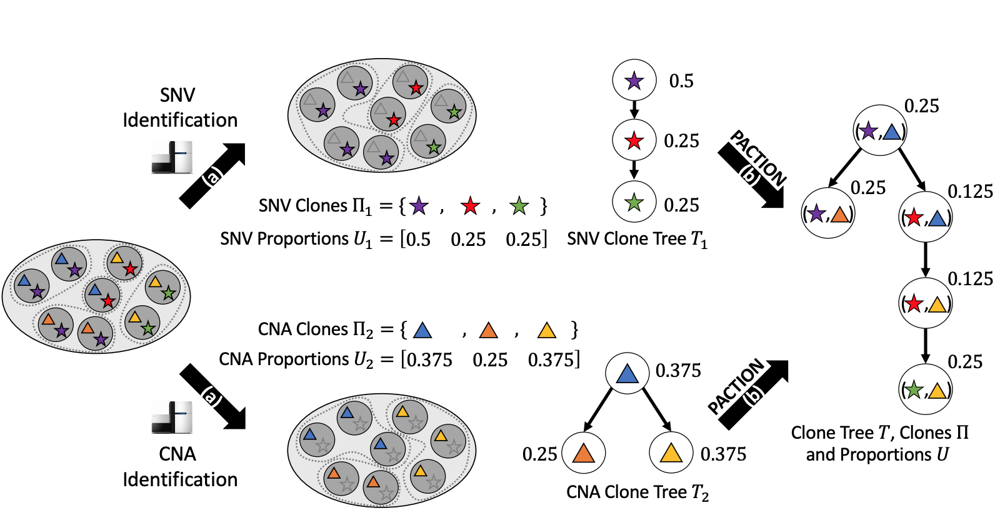

# Paction

A tumor is composed of multiple subpopulations of cells, or clones, with distinct somatic mutations, which can be measured using DNA sequencing.
(a) Due to limitations in inference algorithms and/or sequencing technologies, we are limited to characterizing tumor clones in terms of either single-nucleotide variants (SNVs, stars) or copy-number aberrations (CNAs, triangles).
That is, we infer clones Π1, proportions U1 and a clone tree T1 for the SNVs.
Similarly, we infer clones Π2, proportions U2 and a clone tree T2 for the CNAs.
(b) PACTION solves the Parsimonious Clone Tree Reconciliation problem of inferring clones Π ⊆ Π1 × Π2, a clone tree T and proportions U that characterize the clones of the tumor in terms of both SNVs and CNAs.

## Contents

  1. [Pre-requisites](#pre-requisites)
  2. [Usage instcructions](#usage)
     * [I/O formats](#io)
     * [Paction](#jumper)
     * [simulation](#simulation)

## Pre-requisites
+ python3 (>=3.6)
+ [numpy](https://numpy.org/doc/)
+ [pandas](https://pandas.pydata.org/pandas-docs/stable/index.html)
+ [gurobipy](https://www.gurobi.com/documentation/9.0/quickstart_mac/py_python_interface.html)
+ (optional for generating simulation instances) [snakemake (>=5.2.0)](https://snakemake.readthedocs.io)

## Usage instructions

### I/O formats
The input for Paction are CSV files containing the SNV proportions, CNA proportions. It is important that the format matches the examples such as `data/sample/overview_snv.csv` and `data/sample/overview_cna.csv`. These example files correspond to the overview figure shown above.
The first row, which serves as the header, should be 'genotypes' followed by the sample names, all comma separated.
Each row after that is the name of the genotype/clone, followed by the proportions in each sample.
The input files for the SNV tree and the CNA tree are also CSV files. Each row gives the source and the target of an edge in the tree. Examples corresponding to the overview figure above are shown in `data/sample/overview_snv_tree.csv` and `data/sample/overview_cna_tree.csv`.

### PACTION
    usage: paction.py [-h] --fsnv FSNV --fcna FCNA [--snv_tree SNV_TREE]
                      [--cna_tree CNA_TREE] -o O

    optional arguments:
      -h, --help           show this help message and exit
      --fsnv FSNV          csv file with abundance of each SNV genotype in each
                           sample
      --fcna FCNA          csv file with abundance of each CNA genotype in each
                           sample
      --snv_tree SNV_TREE  csv file containing the edges of SNV tree
      --cna_tree CNA_TREE  csv file containing the edges of CNA tree
      -o O                 output prefix

An example of usage in PCR mode is

    $ python src/paction.py --fsnv data/sample/overview_snv.csv --fcna data/sample/overview_cna.csv -o data/sample/overview_pcr
    
An example of usage in PCTR mode is

    $ python src/paction.py --fsnv data/sample/overview_snv.csv --fcna data/sample/overview_cna.csv --snv_tree data/sample/overview_snv_tree.csv --cna_tree data/sample/overview_cna_tree.csv -o data/sample/overview_pctr

### Simulation
    usage: simulation.py [-h] [-n N] [-m M] [-d D] [-o O] [-s S] [-t T]

    optional arguments:
      -h, --help  show this help message and exit
      -n N        number of samples [1]
      -m M        number of SNV genotypes [5]
      -d D        number of CNA genotypes [4]
      -o O        output prefix
      -s S        seed [0]
      -t T        noise threshold [0.05]

An example simulation is as follows

    $ python src/simulation.py -o data/sample/simulation

The above command generates the follow files.
Filename | DESCRIPTION
-----------------|-------------
`data/sample/simulation_snv.csv` | CSV file with SNV proportions
`data/sample/simulation_cna.csv` | CSV file with CNA proportions
`data/sample/simulation_snv_tree.csv` | CSV file with SNV tree edges
`data/sample/simulation_cna_tree.csv` | CSV file with CNA tree edges
